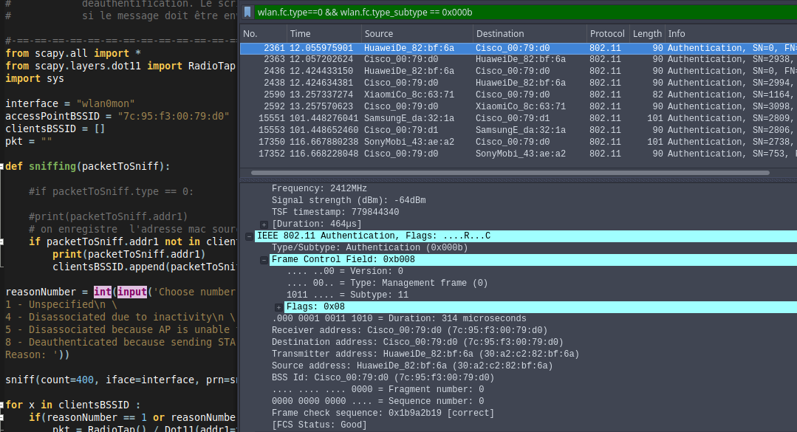
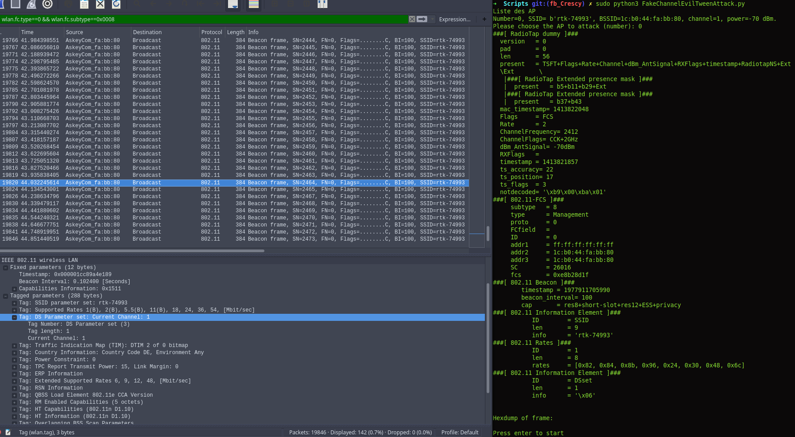
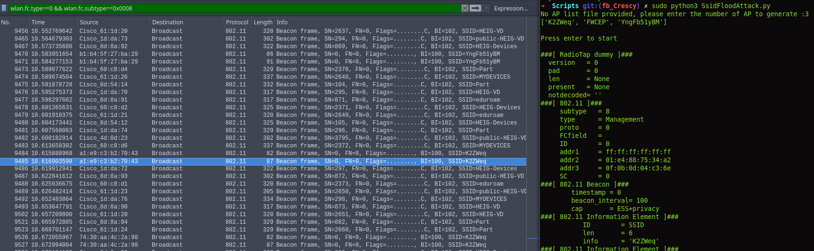

# Sécurité des réseaux sans fil
> Laboratoire: Labo1-MAC-1   
> Étudiants: Yimnaing Crescence, Siu Aurélien

### 1. Deauthentication attack

a) Utiliser la fonction de déauthentification de la suite aircrack, capturer les échanges et identifier le Reason code et son interpretation.

Client mac address: XiaomiCo_8c:63:71 (c4:0b:cb:8c:63:71)
AP mac address: AskeyCom_c4:10:a3 (b4:ee:b4:c4:10:a3)

Commande utilisée: 

```sh
sudo aireplay-ng -0 1 -a b4:ee:b4:c4:10:a3 -c c4:0b:cb:8c:63:71 mon0
```

**Questions : quel code est utilisé par aircrack pour déauthentifier un client 802.11.**

Reason code: Class 3 frame received from nonassociated STA (0x0007)

**Quelle est son interpretation ?**
Le client essaye de transferer les paquets avant que l'association avec l'access point ne soit faite.

__Question__ : A l'aide d'un filtre d'affichage, essayer de trouver d'autres trames de déauthentification dans votre capture. Avez-vous en trouvé d'autres ? Si oui, quel code contient-elle et quelle est son interpretation ?

Nous avons effectivement eu plusieurs trames de déauthentification mais toutes avaient un reason code de classe 3.

b) Développer un script en Python/Scapy capable de générer et envoyer des trames de déauthentification. Le script donne le choix entre des Reason codes différents (liste ci-après) et doit pouvoir déduire si le message doit être envoyé à la STA ou à l'AP :
* 1 - Unspecified
* 4 - Disassociated due to inactivity
* 5 - Disassociated because AP is unable to handle all currently associated stations
* 8 - Deauthenticated because sending STA is leaving BSS

> Chemin du script : HEIGVD-SWI-Labo1-MAC-1/Scripts/GenererEtEnvoyerTramesDeauthentification.py

Preuve de fonctionnement du script:

Nous avons fait une capture de la trame qui se deauthentifie au près de l'AP dont l adresse Mac est : 7C:95:F3:00:79:D0 





Nous avons également capturer la trame correspondant à la réauthentification.

   

__Question__ : quels codes/raisons justifient l'envoie de la trame à la STA cible et pourquoi ?

1 - Unspecified :  La raison pour laquelle on souhaite mettre fin à la connexion n'est pas spécifiée donc on peut feindre d'être l'access point et d'envoyer la trame à la station.<br/>
4 - Disassociated due to inactivity : l'access point constate que la station est inactive donc, nous agissons en tant qu'AP et on envoie une trame à la station pour lui demander de se deconnecter.  
5 - Disassociated because AP is unable to handle all currently associated stations : L'access point n'est pas en mesure de gérer toutes les stations actuellement associées, elle envoie donc un message aux stations pour les déassocier.

__Question__ **: quels codes/raisons justifient l'envoie de la trame à l'AP et pourquoi ?**

1 - Unspecified : La raison pour laquelle on souhaite se désautentifier n'est pas spécifiée donc on peut feindre d'être une station et d'envoyer la trame à l'access point.<br/>
8 - Deauthenticated because sending STA is leaving BSS : la station souhaite se désauthentifier, donc elle envoie un message à l'access point pour lui dire "bye-bye" je quitte la connexion. Nous nous faisons passer pour le client, donc nous envoyons la trame à l'AP.

__Question__ **: Comment essayer de déauthentifier toutes les STA ?**
Il faut sniffer les paquets, récupérer la liste de toutes les adresses Mac des clients connectés à l'access point et celle de l'access point également. Et dans une boucle répétitive, forger des trames de déauthentification pour chaque adresse Mac des stations de liste et envoyer ces trames-là a l'AP avec un "Reason code de 8". Du coup quand les stations retenteront de se connecter, l'access point ne le fera pas car ces stations ont annoncé leur départ.<br/>

__Question__ **: Quelle est la différence entre le code 3 et le code 8 de la liste ?**

Code 3 : la station quitte L'IBSS(Independant Basic Service Set) ou l'ESS(Extended Service Set), Dans ce cas la station peut se reconnecter à un autre access point.<br/>
Code 8 : la station quitte la BSS(Basic Service Set). Elle ne peux pas se reassocier à l'AP immédiatement.

__Question__ **: Expliquer l'effet de cette attaque sur la cible**

Cette attaque déconnecte ou déassocie la cible. Du coup elle n'a plus d'accès internet. Et dans certains cas(reason code 8), la cible est incapable de se réauthentifier dans les minutes qui suivent l'attaque.

### 2. Fake channel evil tween attack

a)	Développer un script en Python/Scapy avec les fonctionnalités suivantes :

* Dresser une liste des SSID disponibles à proximité
* Présenter à l'utilisateur la liste, avec les numéros de canaux et les puissances
* Permettre à l'utilisateur de choisir le réseau à attaquer
* Générer un beacon concurrent annonçant un réseau sur un canal différent se trouvant à 6 canaux de séparation du réseau original

> Chemin du script : HEIGVD-SWI-Labo1-MAC-1/Scripts/FakeChannelEvilTweenAttack.py

Capture d'écran, fonctionnement du script:



Nous avons réussit à changer le canal dans le paquet comme on peut le voir dans le terminal situé à droite. Cependant, le changement ne se voit pas sur wireshark, il reste sur le channel 1.

__Question__ **: Expliquer l'effet de cette attaque sur la cible**

############## Réponse ##################


### 3. SSID flood attack

Développer un script en Python/Scapy capable d'inonder la salle avec des SSID dont le nom correspond à une liste contenue dans un fichier text fournit par un utilisateur. Si l'utilisateur ne possède pas une liste, il peut spécifier le nombre d'AP à générer. Dans ce cas, les SSID seront générés de manière aléatoire.

> Chemin du script : HEIGVD-SWI-Labo1-MAC-1/Scripts/SsidFloodAttack.py

Preuve de  fonctionnement du script:




Comme nous pouvons l'apercevoir à droite nous avons crée trois APs ``K2Zweq``  ``FWCEP`` et ``YngFb51yBM`` et on les retrouve dans la liste des Ssids paquets sniffés.